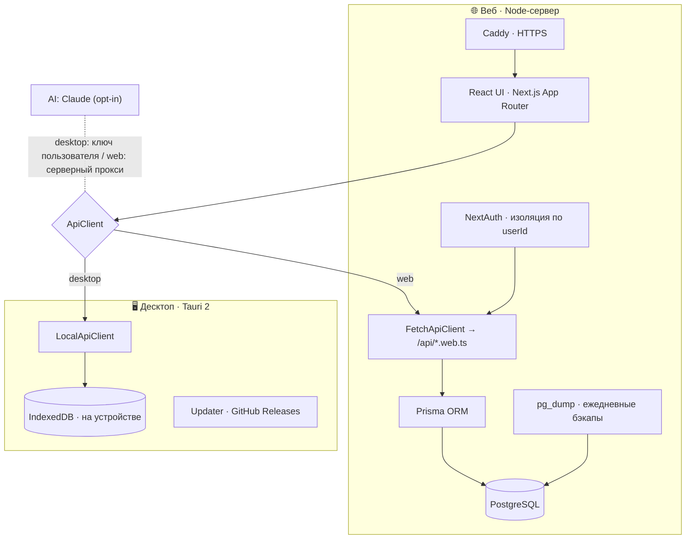

<div align="center">

# 💰 Финансовый помощник

### Личные финансы, бюджеты, цели и аналитика рынка — на десктопе (офлайн) и в вебе

[](https://github.com/Lucky2356/financeapps/actions/workflows/ci.yml)
[](LICENSE)
[](CONTRIBUTING.md)


[](https://nextjs.org/)
[](https://www.typescriptlang.org/)
[](https://tauri.app/)
[](https://www.prisma.io/)
[](https://tailwindcss.com/)

[Возможности](#-возможности) · [Архитектура](#-архитектура) · [Быстрый старт](#-быстрый-старт) · [Десктоп](#-десктоп-windows) · [Деплой](#-деплой-веб) · [Вклад](CONTRIBUTING.md)

</div>

---

**Финансовый помощник** — приложение для учёта личных финансов с двумя режимами из одной кодовой базы:

- 🖥️ **Десктоп (Windows)** — полностью офлайн, данные хранятся локально на устройстве (IndexedDB), без облака и банковских интеграций. Автообновление через GitHub Releases.
- 🌐 **Веб** — многопользовательский режим с регистрацией, изоляцией данных по аккаунту (NextAuth), PostgreSQL и Docker-деплоем.

> **Дисклеймер.** Инвестиционный раздел показывает аналитику, риски и образовательные подсказки и **не** является индивидуальной инвестиционной рекомендацией.

---

## ✨ Возможности

| Раздел | Что умеет |
|---|---|
| **Операции** | Доходы, расходы, переводы между счетами; поиск, фильтры, пагинация |
| **Счета** | Несколько счетов (наличные, карта, накопительный, брокерский) с балансами |
| **Категории** | Цвет, флаги «обязательная»/«подписка», защита от удаления категории с операциями |
| **Бюджеты** | Лимиты по категориям, прогресс, предупреждение при превышении |
| **Цели** | Создание, пополнение, расчёт нужного ежемесячного взноса |
| **Плановые платежи** | Шаблоны (неделя/месяц/год) с авто-проведением наступивших операций |
| **Долги** | Кредиты/займы, влияние на net worth, стратегии погашения (лавина/снежок) |
| **Прогноз** | Денежный поток на 30/90 дней с предупреждением о кассовых разрывах |
| **Аналитика** | Динамика, топ категорий, норма сбережений |
| **Отчёты** | Сводный отчёт с печатью/экспортом в PDF |
| **Инвестиции** | Портфель, watchlist, анализ рисков, структура по секторам (данные MOEX ISS) |
| **Капитал** | Net worth с **реальными снимками во времени** (не только реконструкция) |
| **Дашборд** | Финансовый health-score по факторам, метрики, графики |
| **Импорт/экспорт** | CSV с **авто-определением банка** (Сбер/Т-Банк/Альфа/ВТБ), экспорт CSV/JSON, полный backup |
| **🤖 ИИ-ассистент** | Ввод операции текстом через Claude (opt-in, приватность по умолчанию) |

Дополнительно: мультивалюта, тёмная/светлая тема, плотность интерфейса, горячие клавиши (с русской раскладкой), PWA с офлайн-режимом.

---

## 🏗️ Архитектура

Один фронтенд, два источника данных — абстрагировано через интерфейс `ApiClient` (`lib/api/`).
Серверные API-роуты помечены расширением `.web.ts` и **компилируются только в веб-сборке** — десктопный статический экспорт их не содержит.



| Режим | Платформа | Данные | Запуск |
|---|---|---|---|
| **Десктоп** | Tauri 2 (Windows) | IndexedDB (локально) | статический экспорт в оболочке |
| **Веб** | Node-сервер | PostgreSQL + Prisma | `app/api/*.web.ts` → Prisma |

---

## 🚀 Быстрый старт

```bash
git clone https://github.com/Lucky2356/financeapps.git
cd financeapps
npm install
cp .env.example .env

npm run docker:db:up            # локальный PostgreSQL в Docker
npm run db:migrate              # применить миграции
npm run db:seed                 # демо-данные (опционально)
npm run dev                     # http://localhost:3000
```

> `npm run dev` всегда запускается в **веб-режиме** (Prisma). Локальное хранилище (IndexedDB) проверяется на десктоп-сборке или модульными тестами.

---

## 🖥️ Десктоп (Windows)

Требуется Rust toolchain (подробно — [docs/WINDOWS_DESKTOP.md](docs/WINDOWS_DESKTOP.md)).

```bash
npm run tauri:build     # собрать установщик NSIS
npm run tauri:dev       # запустить в режиме разработки
```

Готовые установщики — на странице [**Releases**](https://github.com/Lucky2356/financeapps/releases). Инструкция для пользователей: [docs/УСТАНОВКА.md](docs/УСТАНОВКА.md). Авто-обновление и подпись описаны в [docs/DESKTOP_UPDATES.md](docs/DESKTOP_UPDATES.md).

---

## 🌐 Деплой (веб)

Веб поднимается в Docker (PostgreSQL + Next.js standalone + Caddy для HTTPS + ежедневные бэкапы):

```bash
cp .env.docker.example .env     # задать POSTGRES_PASSWORD, AUTH_SECRET, ...
docker compose up -d --build
```

Для слабого сервера есть путь со сборкой образа в CI (GHCR) и `docker-compose.prod.yml` — без сборки на сервере. Полное руководство (HTTPS, бэкапы, обновление): [docs/WEB_DEPLOY.md](docs/WEB_DEPLOY.md).

---

## 🧱 Технологии

- **Frontend:** Next.js 16 (App Router), React 18, TypeScript 5, Tailwind CSS, Radix UI, Recharts
- **Backend (web):** Route Handlers, Prisma ORM, PostgreSQL, NextAuth (Auth.js v5)
- **Desktop:** Tauri 2, IndexedDB, плагины updater/process/fs/dialog
- **AI:** Anthropic Claude (`@anthropic-ai/sdk`), opt-in
- **Качество:** Vitest + Testing Library, Playwright (E2E), ESLint, Prettier, Husky + lint-staged
- **Инфра:** Docker, Caddy, GitHub Actions (CI + релизы desktop + образ GHCR), Sentry (опц.)
- **Валидация/утилиты:** Zod, date-fns, PapaParse, bcryptjs

---

## 📁 Структура проекта

```text
app/                # страницы (App Router); серверные роуты — app/api/*/route.web.ts (web-only)
components/         # UI; *-manager.tsx — клиентские обёртки над активным ApiClient
hooks/              # useApiPageData и пр.
lib/
  api/              # ApiClient: FetchApiClient (web) и LocalApiClient (desktop)
  auth/             # NextAuth seam, хеширование паролей, провижининг
  data.ts           # серверное чтение данных (+ заглушки для статического экспорта)
  net-worth*.ts     # расчёт капитала и снимки во времени
services/           # бизнес-логика: прогноз, рекомендации, импорт, рыночные данные, AI
prisma/             # схема БД, миграции, сиды
src-tauri/          # десктоп-оболочка Tauri
tests/              # модульные тесты (Vitest)
e2e/                # Playwright
docs/               # деплой, релизы, десктоп, установка
```

---

## 🛠️ Команды

| Команда | Назначение |
|---|---|
| `npm run dev` | Дев-сервер (веб) |
| `npm run build:web` / `build:static` | Сборка веб / статический экспорт (десктоп) |
| `npm run typecheck` · `lint` | Типы (`tsc --noEmit`) · ESLint (0 предупреждений) |
| `npm run test` · `test:coverage` | Модульные тесты · покрытие |
| `npm run test:e2e` | Playwright E2E |
| `npm run tauri:build` · `tauri:dev` | Десктоп: сборка · запуск |
| `npm run db:migrate` · `db:seed` · `db:studio` | Prisma |
| `npm run docker:db:up` · `docker:db:down` | Локальный PostgreSQL |

---

## ✅ Качество

- **258** модульных тестов (Vitest) + E2E (Playwright)
- Пороги покрытия в CI; гейты: `typecheck`, `lint`, `test`, `build:web`, `build:static`
- Pre-commit хук (Husky + lint-staged): ESLint + Prettier + связанные тесты + typecheck
- Строгая типизация (без `as any`), валидация ввода через Zod

---

## 🔐 Безопасность и приватность

- Веб: пароли — только bcrypt-хеш; **изоляция данных по пользователю** (проверена тестами/рантаймом); rate-limit; HTTPS (Caddy).
- Десктоп: данные не покидают устройство (IndexedDB).
- ИИ-ассистент **выключен по умолчанию**; при включении отправляет минимальный срез во внешний сервис Anthropic с явным предупреждением.
- Банковские логины/скрейпинг **не** используются. Рыночные данные — публичный MOEX ISS.
- Уязвимости — см. [SECURITY.md](SECURITY.md).

---

## 🗺️ Дорожная карта

- [x] Мультивалюта, долги и стратегии погашения, подписки, отчёты/PDF
- [x] ИИ-ассистент (Claude, opt-in) — desktop и web
- [x] Веб: аутентификация и изоляция по пользователю
- [x] Снимки капитала во времени
- [x] Деплой: Docker + HTTPS + бэкапы + CI-образ
- [ ] Сброс пароля по email + OAuth (Google/Yandex)
- [ ] Домен + доверенный TLS-сертификат
- [ ] Семейный/общий доступ к бюджету
- [ ] Масштабирование (реплики БД, кеш, очереди)

---

## 🤝 Вклад в проект

PR и issue приветствуются! Перед началом см. [CONTRIBUTING.md](CONTRIBUTING.md) и [CODE_OF_CONDUCT.md](CODE_OF_CONDUCT.md).
Шаблоны: [баг-репорт](.github/ISSUE_TEMPLATE/bug_report.yml), [предложение фичи](.github/ISSUE_TEMPLATE/feature_request.yml).

## 📜 Лицензия

[MIT](LICENSE) © 2026 Lucky2356 и контрибьюторы. Программа поставляется «как есть»; инвестиционный раздел не является индивидуальной рекомендацией.
