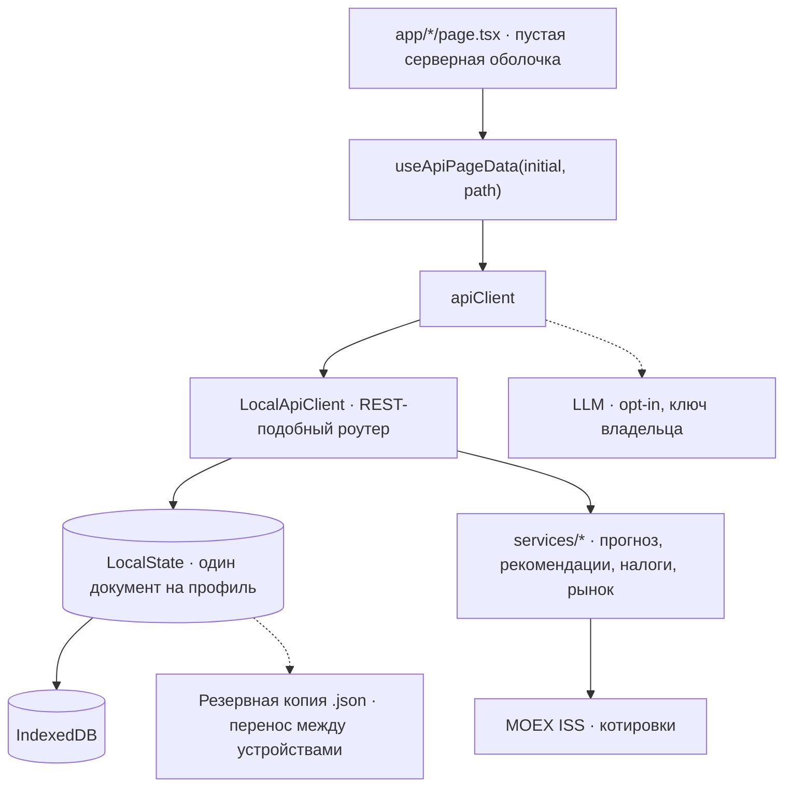

<div align="center">

# Финансовый помощник

**Учёт личных финансов, планирование и анализ портфеля. Windows и Android, один бандл, без сервера.**

[](https://github.com/Lucky2356/financeapps/actions/workflows/ci.yml)
[](https://github.com/Lucky2356/financeapps/actions/workflows/desktop-release.yml)
[](LICENSE)


[](https://nextjs.org/)
[](https://react.dev/)
[](https://www.typescriptlang.org/)
[](https://tauri.app/)

[Возможности](#возможности) · [Архитектура](#архитектура) · [Данные](#данные-и-миграции) ·
[Инварианты](#инварианты-предметной-области) · [Сборка](#сборка-и-запуск) ·
[Релизы](#релизы-и-обновления) · [Тесты](#тестирование-и-гейты)

</div>

---

Приложение для домашней бухгалтерии: операции и счета, лимиты и цели, план/факт по месяцам,
прогноз денежного потока, портфель с ценами Московской биржи. Работает **только на устройстве
владельца** — сервера, аккаунта и облачной синхронизации нет: все данные лежат в IndexedDB того
устройства, где они введены, и переносятся файлом резервной копии.

| | |
|---|---|
| **Платформы** | Windows (NSIS + авто-обновление), Android (APK) |
| **Стек** | Next.js 16 (App Router, `output: export`), React 19, TypeScript 5, Tailwind 3, Radix UI, Recharts 3, Tauri 2 |
| **Хранилище** | IndexedDB, один документ состояния на профиль, `schemaVersion` 12 + миграции |
| **Внешние сервисы** | MOEX ISS (котировки), smart-lab (фундаментальные показатели, десктоп), LLM — опционально и по ключу владельца |
| **Языки интерфейса** | Русский, английский (`lib/i18n/catalog.ts`, переключается на лету) |

> Инвестиционный раздел показывает аналитику, риски и образовательные подсказки и **не** является
> индивидуальной инвестиционной рекомендацией.

---

## Возможности

| Раздел | Что делает |
|---|---|
| **Учёт** | Доходы, расходы, переводы между своими счетами, разбивка чека по категориям; фильтры в строке списка (категория, период, счёт, тип) с состоянием в URL |
| **Счета** | Наличные, карты, накопительные, брокерские; мультивалютность с пересчётом в базовую валюту |
| **Категории** | Иконка и цвет из палитры на 130+ оттенков, подсказка иконки по названию, флаги «обязательная»/«подписка» |
| **Лимиты** | Лимит на категорию в месяц, перенос неизрасходованного остатка, предложение лимитов по истории |
| **Цели** | Пополнение с любого счёта, требуемый ежемесячный взнос, срок достижения |
| **Плановые** | Шаблоны (неделя/месяц/год) с авто-проведением наступивших операций и напоминаниями |
| **Долги** | Кредиты и займы, авто-платежи, стратегии погашения «лавина»/«снежок», влияние на капитал |
| **План/факт** | Таблица «категории × месяцы» в трёх полосах: план вписывается вручную, факт и разница считаются по операциям; любой месяц можно закрепить и удалить, период фильтруется |
| **Прогноз** | Денежный поток на 30/90 дней с предупреждением о кассовых разрывах |
| **Аналитика** | Динамика по месяцам, структура доходов и расходов, тренды категорий, норма сбережений |
| **Отчёты** | Печатная версия с собственной вёрсткой и палитрой (`@media print`) → «Сохранить как PDF» |
| **Инвестиции** | Портфель по средней цене или по списку покупок, watchlist, отраслевая структура, налоговая оценка, ребалансировка, дивиденды |
| **Капитал** | Net worth со снимками во времени, а не только реконструкцией задним числом |
| **Импорт/экспорт** | CSV с авто-определением формата банка (Сбер, Т-Банк, Альфа, ВТБ), маппингом колонок и откатом импорта; экспорт CSV/JSON; полная резервная копия |
| **Профили** | Несколько независимых наборов данных на одном устройстве |
| **ИИ-ассистент** | Ввод операции текстом, разбор чека, коуч по бюджету — Claude / OpenAI / DeepSeek, выключено по умолчанию, ключ владельца |

Дополнительно: тёмная и светлая темы, две плотности интерфейса, командная палитра и горячие
клавиши (в том числе в русской раскладке), онбординг-тур, уведомления.

---

## Архитектура

Одна сборка фронтенда обслуживает обе платформы. Серверной части нет вовсе: страницы
экспортируются статически и приходят пустыми, а цифры подставляет клиент из хранилища устройства.


```mermaid
flowchart TD
    PAGE["app/*/page.tsx · пустая серверная оболочка"] --> HOOK["useApiPageData(initial, path)"]
    HOOK --> CLIENT["apiClient"]
    CLIENT --> LOCAL["LocalApiClient · REST-подобный роутер"]
    LOCAL --> STATE[("LocalState · один документ на профиль")]
    STATE --> IDB[("IndexedDB")]
    LOCAL --> SERVICES["services/* · прогноз, рекомендации, налоги, рынок"]
    SERVICES --> MOEX["MOEX ISS · котировки"]
    STATE -.-> BACKUP["Резервная копия .json · перенос между устройствами"]
    CLIENT -.-> AI["LLM · opt-in, ключ владельца"]
```

**Как читается страница.** `page.tsx` — серверный компонент, который отдаёт типизированную
заглушку из `lib/data.ts`. Клиентская обёртка (`*-manager.tsx`, `*-view.tsx`) вызывает
`useApiPageData(initialData, "/transactions?…")`, тот идёт в `apiClient`, а он — в
`LocalApiClient`, который собирает ответ из состояния устройства. Один и тот же путь работает и в
браузере при `npm run dev`, и внутри WebView2 на Windows, и внутри Android WebView.

**`LocalApiClient`** (`lib/api/LocalApiClient.ts`, ~3000 строк) — единственный источник данных.
Он держит REST-подобную поверхность (`GET /transactions`, `POST /plan`, `POST /investments` и так
далее), чтобы экраны не знали, откуда приходят цифры, и чтобы вся работа с деньгами лежала в одном
месте: чтение страниц, запись, пересчёт балансов, деривации для графиков.

**Оболочка.** Tauri 2 c плагинами `fs`, `dialog`, `http`, `opener`, `process` на обеих платформах и
`updater` + `window-state` только на десктопе (у них нет Android-реализации). Разрешённые адреса
пришпилены в `src-tauri/capabilities/default.json`.

---

## Данные и миграции

Всё состояние профиля — один валидируемый Zod-схемой документ (`lib/api/local/schemas.ts`):

```ts
LocalState {
  schemaVersion; currency; theme; density; …          // настройки
  accounts[]; categories[]; transactions[];            // учёт
  budgets[]; goals[]; liabilities[]; recurringTransactions[];
  plans[]; planNotes[]; planMonths[];                  // план/факт
  investments{ portfolio[]; watchlist[]; … };          // портфель
  netWorthSnapshots[]; realizedInvestmentEvents[]; importBatches[];
}
```

- **Миграции** — `lib/storage/migrations/runLocalStateMigrations.ts`, текущая версия **12**.
  Каждая миграция поднимает документ на одну ступень; состояние, записанное старой версией
  приложения, читается новой без потерь.
- **Повреждённый документ не роняет приложение**: `salvageLocalState` отбирает то, что валидно,
  вместо того чтобы отвергнуть файл целиком.
- **Профили** — независимые документы в одном хранилище; переключение перезагружает приложение.
- **Резервная копия** — тот же документ в JSON. Это же и способ переезда на другое устройство.

---

## Инварианты предметной области

Правила, которые легко нарушить и дорого чинить, вынесены в отдельные модули и закрыты тестами:

| Инвариант | Где живёт |
|---|---|
| Перевод между своими счетами — пара обычных операций с общим `transferId`; он двигает балансы, но не является доходом или расходом, поэтому исключается из итогов по выбору читателя | `lib/transactions/transfers.ts` |
| План — не учёт: плановые суммы никогда не смешиваются с фактическими операциями | `lib/api/LocalApiClient.ts` (`planFactPage`) |
| Операция хранится в валюте счёта; в базовую валюту она пересчитывается **на чтение** (`baseAmount`), а не при записи | `lib/transactions/base-amount.ts` |
| Фильтрация операций описывается URL-параметрами и одинаково применяется на сервере списка и в UI | `lib/transactions/filter.ts` |
| Отрасль бумаги берётся из собственной таблицы тикеров, а ручной выбор владельца её перекрывает | `lib/market/sectors.ts` |
| Импорт CSV создаёт недостающие счета и категории по именам из файла и откатывается одной кнопкой | `LocalApiClient.importCsvRows` / `undoLastImport` |
| Цвета графиков берутся из токенов темы (`hsl(var(--token))`), поэтому следуют теме и печати без JS | `lib/charts/palette.ts` |

---

## Сборка и запуск

```bash
git clone https://github.com/Lucky2356/financeapps.git
cd financeapps
npm install
npm run dev            # http://localhost:3000 — то же приложение в браузере
```

В браузере доступны все экраны и те же локальные данные; недоступны только нативные диалоги
файлов — вместо них обычная загрузка и выгрузка.

### Windows

Нужен Rust toolchain — подробности в [docs/WINDOWS_DESKTOP.md](docs/WINDOWS_DESKTOP.md).

```bash
npm run tauri:dev      # запуск в режиме разработки
npm run tauri:build    # установщик NSIS
```

### Android

Нужны Android SDK, NDK и JDK 17 — подробности и работа с ключом подписи в
[docs/ANDROID.md](docs/ANDROID.md).

```bash
npm run android:dev           # на подключённом устройстве
npm run android:build         # релизный APK (нужен keystore)
npm run android:build:debug   # отладочный APK, ставится без своего ключа
```

Готовые сборки — на странице [Releases](https://github.com/Lucky2356/financeapps/releases),
инструкция для пользователя — [docs/УСТАНОВКА.md](docs/УСТАНОВКА.md).

---

## Релизы и обновления

1. Версия поднимается в `package.json`, `src-tauri/tauri.conf.json`, `src-tauri/Cargo.toml` и
   `Cargo.lock`; в `CHANGELOG.md` добавляется секция релиза.
2. Тег `vX.Y.Z` запускает [`desktop-release.yml`](.github/workflows/desktop-release.yml): гейты →
   сборка подписанного установщика → проверка подписи апдейтера против вшитого публичного ключа →
   генерация и валидация `latest.json` → публикация релиза с описанием из `CHANGELOG.md`.
3. APK собирается на машине владельца и прикладывается к тому же релизу: ключ подписи Android
   никогда не покидает её и никогда не меняется — иначе обновление не встанет поверх установленного
   приложения.

Десктоп обновляется сам через `tauri-plugin-updater` (манифест `latest.json` в последнем релизе),
Android проверяет наличие новой версии и предлагает скачать APK. Подробности —
[docs/DESKTOP_UPDATES.md](docs/DESKTOP_UPDATES.md), чек-лист — [docs/RELEASE_CHECKLIST.md](docs/RELEASE_CHECKLIST.md).

---

## Тестирование и гейты

| Гейт | Команда | Что проверяет |
|---|---|---|
| Типы | `npm run typecheck` | `tsc --noEmit`, строгий режим |
| Стиль | `npm run lint` | ESLint с `--max-warnings=0` |
| Модульные | `npm run test` | **557** тестов в 99 файлах (Vitest + Testing Library): деньги, миграции, фильтры, сервисы, компоненты |
| Сборка | `npm run build:static` | статический экспорт — общий бандл обеих оболочек |
| E2E | `npm run test:e2e` | **135** проверок в 15 сценариях (Playwright) против **собранного статического приложения**, а не дев-сервера |

E2E гоняются по реальному пути данных: сценарий засеивает встроенный пример через кнопку самого
приложения и дальше работает с IndexedDB так же, как пользователь. Отдельно есть «камера»
(`e2e/shots.spec.ts`, запускается вручную с `SHOTS=1`) — она не проверяет ничего, а снимает экраны
релиза, чтобы их можно было оценить глазами.

Перед коммитом Husky + lint-staged прогоняют ESLint, Prettier и связанные тесты; в CI дополнительно
работает CodeQL.

---

## Структура проекта

```text
app/                 # маршруты App Router; серверные страницы отдают пустые оболочки
components/          # UI; *-manager.tsx / *-view.tsx — клиентские экраны поверх LocalApiClient
  ui/                # примитивы (Radix + Tailwind): Card, Table, Select, Dialog, StatTile…
hooks/               # useApiPageData, useApiMutation, useAiSettings…
lib/
  api/               # LocalApiClient и его Zod-схемы состояния
  data.ts            # типы данных страниц и пустые заглушки серверной оболочки
  storage/           # адаптеры IndexedDB и миграции состояния
  transactions/      # фильтры, переводы, пересчёт в базовую валюту
  market/            # отрасли тикеров, smart-lab, ряды цен
  charts/, i18n/     # палитры графиков, каталог строк ru/en
services/            # прогноз, рекомендации, налоги, импорт, рыночные данные, ИИ
src-tauri/           # оболочка Tauri: Rust, capabilities, gen/android — gradle-проект
tests/               # Vitest
e2e/                 # Playwright
docs/                # десктоп, Android, обновления, релизный чек-лист, установка
scripts/             # иконки, манифест обновления, проверка подписи, статический сервер
```

---

## Приватность и безопасность

- Данные не покидают устройство: нет сервера, аккаунта и облачной синхронизации.
- Перенос между устройствами делает владелец — файлом резервной копии.
- Банковские логины и скрейпинг банков не используются; котировки берутся из публичного MOEX ISS.
- ИИ-ассистент выключен по умолчанию. При включении во внешний сервис уходит минимальный срез
  данных, по ключу самого владельца, с явным предупреждением в интерфейсе.
- Приватный ключ апдейтера и Android-keystore в репозитории отсутствуют и никогда в него не
  попадают. О найденных уязвимостях — [SECURITY.md](SECURITY.md).

---

## Дорожная карта

- [x] Мультивалюта, долги и стратегии погашения, подписки, отчёты и печать
- [x] ИИ-ассистент (Claude / OpenAI / DeepSeek, opt-in)
- [x] Снимки капитала во времени
- [x] План/факт отдельно от учёта; произвольные месяцы в сетке
- [x] Android-версия с переносом данных с ПК и обратно
- [ ] Обмен резервной копией между устройствами без ручного переноса файла
- [ ] Общий доступ к бюджету для семьи

---

## Вклад в проект

Issue и PR приветствуются: [CONTRIBUTING.md](CONTRIBUTING.md), [CODE_OF_CONDUCT.md](CODE_OF_CONDUCT.md),
шаблоны [бага](.github/ISSUE_TEMPLATE/bug_report.yml) и [предложения](.github/ISSUE_TEMPLATE/feature_request.yml).

## Лицензия

[MIT](LICENSE) © 2026 Lucky2356 и контрибьюторы. Программа поставляется «как есть»; инвестиционный
раздел не является индивидуальной инвестиционной рекомендацией.
